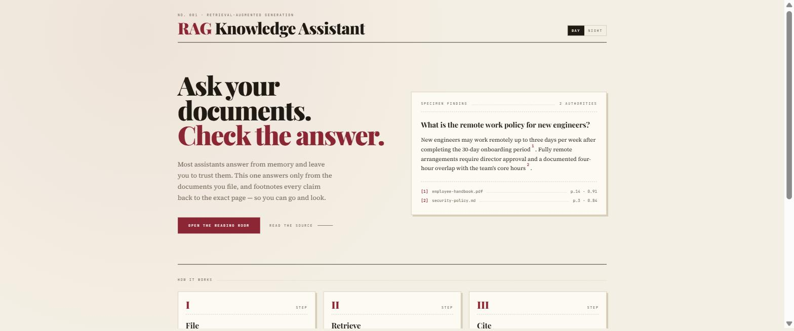
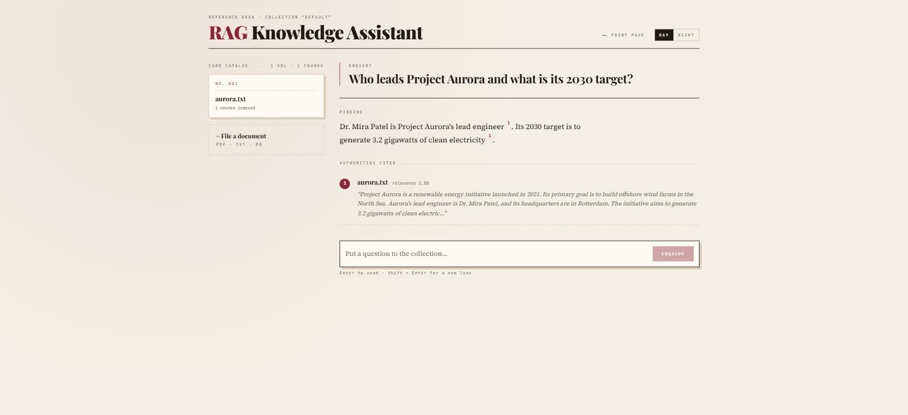
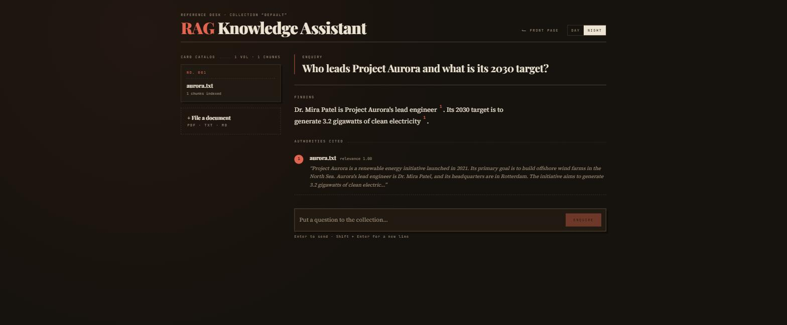
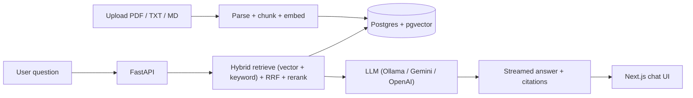

# RAG Knowledge Assistant


An end-to-end, production-style **Retrieval-Augmented Generation** application: upload
your documents (PDF / TXT / Markdown) and chat with them. Answers are grounded in your
files and include **inline numbered citations** back to the exact source passages.

Built to demonstrate the full ML application lifecycle — ingestion, embeddings, a vector
database, hybrid retrieval with reranking, LLM generation with streaming, a modern web
UI, containerization, CI, an evaluation harness, and cloud deployment.

## Live demo

**→ [3.219.155.208:3000](http://3.219.155.208:3000)** — running on a single AWS EC2
instance, answers served by the free Gemini tier.

A sample document is already indexed, so you can ask a question straight away. Upload
your own from the card catalog on the left.

## Demo



Ask a question and the answer streams back with numbered footnotes. Each one names the
document, the page, and the relevance the reranker assigned to that passage — so any
claim can be traced to the text it came from.



The interface ships in two themes. Dark is not an inversion of light: the oxblood accent
loses its chroma at low luminance, so it warms to ember instead.



## Engineering highlights

- **Retrieval quality, not just a vector lookup:** combines dense (pgvector) and
  keyword (Postgres full-text) search, fuses them with Reciprocal Rank Fusion, then
  reorders with a cross-encoder reranker — a measurable step up from naive similarity search.
- **Grounded and trustworthy:** every answer streams with inline `[n]` citations tied to
  the exact source passage, and the model is instructed to refuse when the context is insufficient.
- **Provider-agnostic by design:** a thin LLM abstraction lets you switch between local
  Ollama, Google Gemini, and OpenAI with one environment variable — zero code changes.
- **Cost-aware:** embeddings and reranking run locally for free (fastembed/ONNX, CPU); the
  cloud deployment uses a free LLM tier and fits inside the AWS Free Tier.
- **Measured, not guessed:** a `ragas` harness quantifies faithfulness and context
  precision/recall so retrieval changes can be evaluated objectively.
- **Ship-ready:** Dockerized, CI on every push, and one-command deploy/teardown for AWS.

## Features

- **Document ingestion** for PDF, TXT, and Markdown with sentence-aware chunking.
- **Local, free embeddings** via `fastembed` (BAAI/bge-small) — no API key needed.
- **Vector search** with Postgres + `pgvector` (HNSW index).
- **Hybrid retrieval**: dense vector search + keyword full-text search fused with
  Reciprocal Rank Fusion, then a **cross-encoder reranker** for the final ordering.
- **Provider-agnostic LLM layer**: swap between local **Ollama** (free), **Google Gemini**
  (free tier), and **OpenAI** with a single env var.
- **Token-by-token streaming** answers over Server-Sent Events.
- **Citations**: every answer references the source document, page, and passage.
- **Evaluation harness** using `ragas` (faithfulness, answer relevancy, context
  precision/recall) so retrieval-quality improvements are measurable.
- **Dockerized** with `docker compose`, **CI** via GitHub Actions, and **AWS deploy**
  scripts.

## Architecture



## Tech stack

| Layer        | Technology                                                        |
|--------------|-------------------------------------------------------------------|
| Frontend     | Next.js 14 (App Router), React 18, TypeScript, Tailwind CSS 4     |
| Backend      | FastAPI, Python 3.12, async streaming (SSE)                       |
| Embeddings   | fastembed (ONNX, CPU) — BAAI/bge-small-en-v1.5                    |
| Reranker     | fastembed cross-encoder (ms-marco-MiniLM)                         |
| Vector store | PostgreSQL 16 + pgvector (HNSW)                                   |
| LLM          | Ollama / Google Gemini / OpenAI (pluggable)                       |
| Infra        | Docker, docker compose, GitHub Actions, AWS (EC2)                 |
| Eval         | ragas                                                             |

## Quickstart (local, 100% free)

Requires Docker and (for the default local LLM) [Ollama](https://ollama.com).

```bash
# 1. Configure environment
cp .env.example .env

# 2. (Default LLM) pull a local model with Ollama
ollama pull llama3.1

# 3. Start everything
docker compose up --build
```

Then open:
- Frontend: http://localhost:3000
- Backend docs: http://localhost:8000/docs

Upload a document in the sidebar and start asking questions.

> Prefer a hosted model? Set `LLM_PROVIDER=gemini` and `GEMINI_API_KEY=...` in `.env`
> (free key at https://aistudio.google.com/apikey), then no local model is needed.

## Configuration

All settings are environment variables (see `.env.example`). Key ones:

| Variable          | Default                     | Description                              |
|-------------------|-----------------------------|------------------------------------------|
| `LLM_PROVIDER`    | `ollama`                    | `ollama` \| `gemini` \| `openai`          |
| `EMBEDDING_MODEL` | `BAAI/bge-small-en-v1.5`    | fastembed model (must match `EMBEDDING_DIM`) |
| `USE_RERANKER`    | `true`                      | Toggle the cross-encoder reranker        |
| `RETRIEVE_TOP_K`  | `20`                        | Candidates fetched before reranking      |
| `FINAL_TOP_K`     | `5`                         | Passages sent to the LLM                 |
| `CHUNK_SIZE`      | `800`                       | Target chunk size (characters)           |

## API

| Method | Path                | Description                              |
|--------|---------------------|------------------------------------------|
| GET    | `/health`           | Service + provider status                |
| POST   | `/documents`        | Upload & ingest a file (multipart)       |
| GET    | `/documents`        | List indexed documents                   |
| DELETE | `/documents/{id}`   | Delete a document and its chunks         |
| POST   | `/chat`             | Ask a question (streams SSE)             |

## Evaluation

Measure RAG quality with a labeled dataset (edit `backend/eval/eval_dataset.json`):

```bash
pip install -r backend/eval/requirements.txt
export OPENAI_API_KEY=...   # ragas needs a judge LLM
python backend/eval/ragas_eval.py --api http://localhost:8000 --collection default
```

This reports faithfulness, answer relevancy, and context precision/recall — run it
with the reranker on vs. off to demonstrate a measurable retrieval improvement.

## Tests

```bash
cd backend
pip install -r requirements.txt pytest
pytest
```

## Deployment

See [`deploy/aws/README.md`](deploy/aws/README.md) for one-command deployment to a
single EC2 instance using the free Gemini API. The default is a `t3.micro` with a 2 GB
swap file so the ONNX embedding and reranker models fit in 1 GB of RAM — Free Tier
eligible, so the running cost is the public IPv4 charge alone.

## Project structure

```
rag-knowledge-assistant/
├── backend/            FastAPI service
│   ├── app/
│   │   ├── main.py         API endpoints (upload, list, chat/SSE)
│   │   ├── ingestion.py    parse -> chunk -> embed -> store
│   │   ├── chunking.py     fixed & sentence-aware chunkers
│   │   ├── embeddings.py   fastembed embeddings + reranker
│   │   ├── retrieval.py    hybrid search + RRF + rerank
│   │   ├── rag.py          prompt building + streaming + citations
│   │   ├── llm/            pluggable providers (ollama/gemini/openai)
│   │   ├── db.py           pgvector schema + connection pool
│   │   └── config.py       env-based settings
│   ├── tests/          unit tests (chunking, RRF)
│   └── eval/           ragas evaluation harness
├── frontend/           Next.js UI
│   ├── app/page.tsx        landing page
│   ├── app/assistant/      the assistant (streaming + citations)
│   └── components/         design system pieces (light + dark)
├── deploy/aws/         EC2 deploy + teardown scripts
├── .github/workflows/  CI (lint, tests, docker build)
└── docker-compose.yml  full local stack
```

## License

MIT
